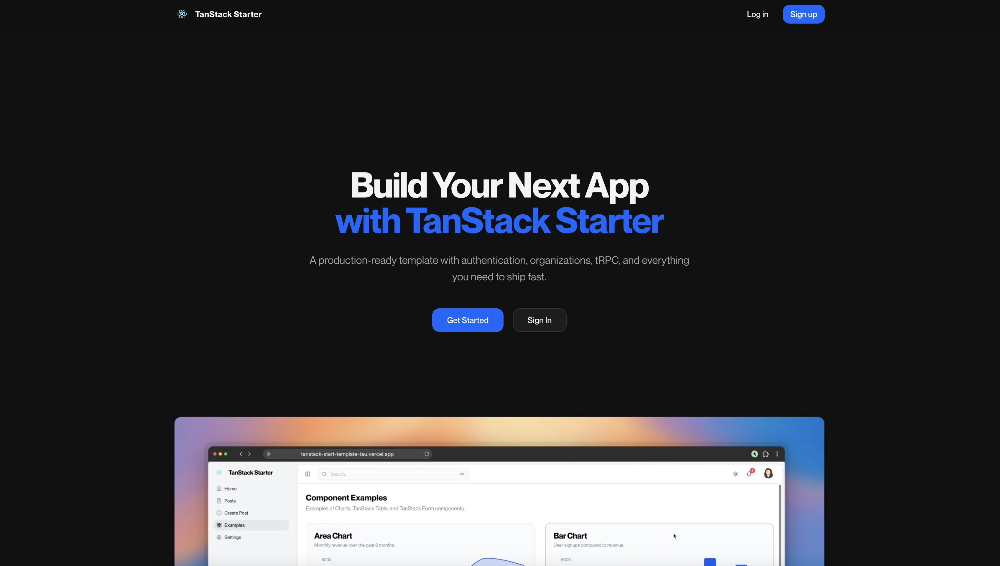

# TanStack Starter

A production-ready full-stack template built with TanStack Start, featuring authentication, organizations, tRPC, and everything you need to ship fast.



## Tech Stack

### Framework & Routing

- **[TanStack Start](https://tanstack.com/start)** - Full-stack React framework with SSR/SSG support
- **[TanStack Router](https://tanstack.com/router)** - Type-safe file-based routing with built-in data loading
- **[TanStack Query](https://tanstack.com/query)** - Powerful data fetching and caching
- **[TanStack Table](https://tanstack.com/table)** - Headless table utilities
- **[TanStack Form](https://tanstack.com/form)** - Type-safe form handling

### Backend & API

- **[tRPC](https://trpc.io)** - End-to-end type-safe APIs without schemas or code generation
- **[Drizzle ORM](https://orm.drizzle.team)** - Type-safe SQL with automatic migrations
- **[PostgreSQL](https://www.postgresql.org)** - Database via Supabase connection pooling
- **[Zod](https://zod.dev)** - Schema validation for runtime type safety

### Authentication

- **[Better Auth](https://better-auth.com)** - Complete authentication solution
  - Email/password authentication with verification
  - Google OAuth integration
  - Two-factor authentication (2FA)
  - Organization/team management
  - Session management

### UI & Styling

- **Custom Design System** - Refined component library with a cohesive design language built on top of shadcn/ui
- **[Tailwind CSS v4](https://tailwindcss.com)** - Utility-first CSS framework
- **[shadcn/ui](https://ui.shadcn.com)** - Accessible component primitives
- **[Radix UI](https://radix-ui.com)** - Unstyled, accessible components
- **[Lucide Icons](https://lucide.dev)** - Beautiful icon set
- **[Sonner](https://sonner.dev)** - Toast notifications
- **[cmdk](https://cmdk.paco.me)** - Command palette component

### Monitoring & Analytics

- **[Sentry](https://sentry.io)** - Error tracking and performance monitoring
- **[PostHog](https://posthog.com)** - Product analytics
- **[Vercel Analytics](https://vercel.com/analytics)** - Web analytics

### Email

- **[Resend](https://resend.com)** - Transactional emails with React templates

### Developer Experience

- **[Biome](https://biomejs.dev)** - Fast linting and formatting
- **[Vitest](https://vitest.dev)** - Unit and integration testing
- **[T3 Env](https://env.t3.gg)** - Type-safe environment variables
- **[TypeScript](https://typescriptlang.org)** - Static type checking

## What's Included

### Authentication System

- Email/password signup with email verification
- Google OAuth login
- Password reset flow
- Protected routes and middleware
- Session management

### Organization/Team Features

- Create and manage organizations
- Invite team members via email
- Role-based access control
- Organization switching

### Dashboard

- Responsive sidebar navigation
- User account dropdown
- Settings pages (profile, teams, shortcuts)
- Command palette (Cmd+K)

### UI Components

- Customized shadcn/ui component library with a polished design language
- Dark/light/system theme support
- Loading states and progress indicators
- Form validation with error handling
- Toast notifications

### API Layer

- tRPC router setup with context
- Database queries with Drizzle
- Rate limiting with Upstash
- Error handling

### Email Templates

- Password reset emails
- Team invitation emails

### Legal Pages

- Privacy policy template
- Terms of service template

## Getting Started

### Prerequisites

- Node.js 18+
- pnpm (recommended) or npm
- PostgreSQL database (Supabase recommended)

### Installation

```bash
# Install dependencies
pnpm install

# Copy environment variables
cp .env.example .env

# Update .env with your values
```

### Environment Variables

Configure the following in your `.env` file:

- `DATABASE_URL` - PostgreSQL connection string
- `SUPABASE_URL` & `SUPABASE_SERVICE_ROLE_KEY` - Supabase credentials
- `BETTER_AUTH_SECRET` - Auth secret (generate with `openssl rand -base64 32`)
- `VITE_GOOGLE_CLIENT_ID` & `GOOGLE_CLIENT_SECRET` - Google OAuth
- `RESEND_API_KEY` - Email sending
- `SENTRY_AUTH_TOKEN` - Error tracking
- `VITE_PUBLIC_POSTHOG_KEY` - Analytics

### Database Setup

```bash
# Generate migrations
pnpm db:generate

# Push schema to database
pnpm db:push

# Open Drizzle Studio
pnpm db:studio
```

### Development

```bash
# Start development server
pnpm dev
```

Open [http://localhost:3000](http://localhost:3000) in your browser.

### Production Build

```bash
# Build for production
pnpm build

# Start production server
pnpm start
```

## Project Structure

```
src/
├── app/                 # App-level configuration
├── components/          # React components
│   └── ui/              # shadcn/ui components
├── config/              # App configuration
├── hooks/               # Custom React hooks
├── integrations/        # Third-party integrations
│   ├── tanstack-query/  # Query client setup
│   └── trpc/            # tRPC router and client
├── layouts/             # Layout components
├── lib/                 # Utilities and core logic
│   ├── auth/            # Authentication setup
│   ├── db/              # Database schema and queries
│   ├── email/           # Email templates
│   └── utils/           # Helper functions
├── routes/              # File-based routes
│   ├── dashboard/       # Dashboard pages
│   └── settings/        # Settings pages
└── styles/              # Global styles
```

## Scripts

```bash
pnpm dev          # Start development server
pnpm build        # Build for production
pnpm start        # Start production server
pnpm test         # Run tests
pnpm lint         # Lint code
pnpm format       # Format code
pnpm check        # Run all checks
pnpm typecheck    # Type check
pnpm db:generate  # Generate migrations
pnpm db:push      # Push schema to database
pnpm db:studio    # Open Drizzle Studio
```

## Adding Components

```bash
# Add shadcn/ui components
pnpx shadcn@latest add button
pnpx shadcn@latest add card
```

## Deployment

This template is optimized for deployment on [Vercel](https://vercel.com). Simply connect your repository and deploy.

For other platforms, build the application and run the production server:

```bash
pnpm build
pnpm start
```

## License

MIT
